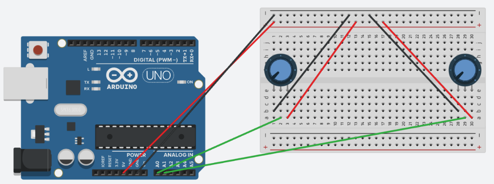

# 🏓 Pongino

## Conceito

O projeto demonstra a comunicação entre potenciômetros conectados a um Arduino e uma interface Pong distribuída por HTTP e WebSocket. A aplicação lê amostras pela porta serial, normaliza os valores para percentuais, cria um estado de domínio para as duas raquetes e publica atualizações em tempo real para os navegadores conectados.

A fonte serial usa streams assíncronos e tenta reconectar à porta configurada após falhas. O servidor Tornado e a leitura serial compartilham o mesmo event loop do `asyncio`, iniciado por `asyncio.run()`.

## Componentes Físicos



O circuito é composto por um Arduino Uno conectado a dois potenciômetros montados em uma protoboard:

- **Potenciômetro 1 (Jogador 1 - Esquerda):** conectado ao pino analógico `A0`
- **Potenciômetro 2 (Jogador 2 - Direita):** conectado ao pino analógico `A1`
- **Alimentação:** pinos `5V` e `GND` do Arduino distribuídos para os barramentos da protoboard

## Tecnologias

### Execução

- [Python 3.12+](https://docs.python.org/3.12/)
- [Tornado 6.4+](https://www.tornadoweb.org/en/stable/)
- [pyserial](https://pyserial.readthedocs.io/en/latest/)
- [pyserial-asyncio](https://pyserial-asyncio.readthedocs.io/en/latest/)
- [pydantic-settings](https://docs.pydantic.dev/latest/concepts/pydantic_settings/)
- [HTML Canvas API](https://developer.mozilla.org/en-US/docs/Web/API/Canvas_API)
- [JavaScript ES Modules](https://developer.mozilla.org/en-US/docs/Web/JavaScript/Guide/Modules)
- [WebSocket API](https://developer.mozilla.org/en-US/docs/Web/API/WebSockets_API)
- [Tailwind CSS Play CDN](https://tailwindcss.com/docs/installation/play-cdn)
- [Arduino IDE](https://docs.arduino.cc/software/ide-v2)
- [Arduino Language Reference](https://docs.arduino.cc/language-reference/)

### Desenvolvimento

- [uv](https://docs.astral.sh/uv/)
- [pytest](https://docs.pytest.org/en/stable/)
- [pytest-asyncio](https://pytest-asyncio.readthedocs.io/en/stable/)
- [Ruff](https://docs.astral.sh/ruff/)
- [Based Pyright](https://docs.basedpyright.com/latest/)
- [Taskipy](https://github.com/taskipy/taskipy)
- [Rich](https://rich.readthedocs.io/en/stable/)

## Como executar

Instale o `uv`, copie `.env.example` para `.env` e substitua todos os placeholders descritivos por valores válidos para o ambiente e o dispositivo utilizado.

```bash
uv sync
cp .env.example .env
```

Mantenha o `.env` diretamente na raiz do projeto, ao lado de `pyproject.toml`.
O servidor e o `launch.json` carregam especificamente `${workspaceFolder}/.env`.
O `uv sync` instala o pacote local no ambiente virtual, portanto não é necessário
definir `PYTHONPATH`. Os comandos Python da aplicação são executados como
módulos, preservando a raiz do projeto no caminho de importação.

Para usar o Arduino, configure `PONG_SERIAL_PORT`. Exemplos de portas seriais:

- macOS: `/dev/cu.usbmodemXXXX` ou `/dev/cu.usbserial-XXXX`;
- Linux: `/dev/ttyACM0` ou `/dev/ttyUSB0`;
- Windows: `COM3`.

Um `.env` mínimo pode conter:

```dotenv
PONG_SERIAL_PORT=/dev/cu.usbmodemXXXX
PONG_SERIAL_BAUDRATE=115200
PONG_SERIAL_TIMEOUT_SECONDS=1
PONG_SERIAL_STARTUP_DELAY_SECONDS=2
PONG_SERIAL_RECONNECT_DELAY_SECONDS=2
PONG_POT1_PIN=A0
PONG_POT2_PIN=A1
PONG_SERVER_HOST=0.0.0.0
PONG_SERVER_PORT=8888
```

A fonte serial usa `PONG_SERIAL_TIMEOUT_SECONDS` para limitar a espera de cada linha, `PONG_SERIAL_STARTUP_DELAY_SECONDS` para aguardar a inicialização do Arduino e `PONG_SERIAL_RECONNECT_DELAY_SECONDS` para controlar o intervalo entre tentativas.

O parser espera os valores do Arduino na sequência `valor1`, `;`, `valor2`,
com cada item em uma linha. Os valores analógicos devem estar entre `0` e
`1023`, por exemplo:

```text
512
;
768
```

Inicie o servidor:

```bash
uv run task run
```

Acesse `http://localhost:8888` no navegador.

### Debug no VS Code

1. Execute `uv sync` para criar ou atualizar o ambiente virtual.
2. Selecione o interpretador `.venv` no VS Code.
3. Abra **Run and Debug**.
4. Selecione **Python: servidor Pongino** e pressione `F5`.

A configuração em `.vscode/launch.json` executa o módulo `pong.cli.server`, usa
a raiz do projeto como diretório de trabalho e carrega as variáveis de `.env`.
Os logs de inicialização ficam visíveis no terminal integrado.

Para acompanhar os potenciômetros no terminal:

O diagnóstico usa Rich com tabela e barras atualizadas em tempo real. Rich pertence ao grupo `dev`, instalado por `uv sync`; *esse comando deve ser executado sem o servidor principal, pois a porta serial normalmente não pode ser aberta por dois processos ao mesmo tempo*.

```bash
uv run task cli
```

Os comandos de qualidade são:

```bash
uv run task test
uv run task lint
uv run task format
uv run task type-check
```

O comando `test` executa os testes Python da pasta `test/` com pytest e exige
cobertura mínima de 95% (linhas e branches). Os testes assíncronos usam
pytest-asyncio e não dependem de um Arduino conectado. O comando `type-check`
executa o Based Pyright. O lint e a formatação são executados pelo Ruff.

## Observabilidade

O servidor configura o logging no entrypoint e registra a inicialização e a
finalização da fonte de entrada, tentativas de conexão serial, falhas de
leitura e conexões WebSocket. O cliente WebSocket atualiza o indicador da
interface e tenta reconectar com intervalo progressivo quando a conexão é
encerrada.

As rotas principais são:

- `GET /`: página do jogo;
- `GET /static/...`: arquivos JavaScript e recursos estáticos;
- `WebSocket /ws`: conexão em tempo real com o estado das raquetes.

Uma mensagem de atualização de raquete tem este formato:

```json
{
  "type": "paddle_update",
  "player1_pct": 50.0,
  "player2_pct": 75.0,
  "timestamp": 1710000000.0
}
```

## Estrutura

```text
├── .gitignore
├── .env.example
├── .vscode/
│   └── launch.json
├── AGENTS.md
├── README.md
├── docs/
│   └── componentes-fisicos.png
├── test/
│   ├── conftest.py
│   ├── test_api.py
│   ├── test_config.py
│   ├── test_connection_manager.py
│   ├── test_domain.py
│   ├── test_parser.py
│   ├── test_serial_source.py
│   ├── test_serialization.py
│   └── test_server.py
├── pong/
│   ├── __init__.py
│   ├── config.py
│   ├── api/
│   │   ├── __init__.py
│   │   ├── app.py
│   │   ├── http/
│   │   │   ├── __init__.py
│   │   │   └── index_handler.py
│   │   └── websocket/
│   │       ├── __init__.py
│   │       ├── connection_manager.py
│   │       ├── handler.py
│   │       └── serializer.py
│   ├── cli/
│   │   ├── __init__.py
│   │   ├── pots.py
│   │   └── server.py
│   ├── domain/
│   │   ├── __init__.py
│   │   ├── potenciometro/
│   │   │   ├── __init__.py
│   │   │   ├── entity.py
│   │   │   ├── normalization.py
│   │   │   └── reading.py
│   │   └── pong/
│   │       ├── __init__.py
│   │       └── state.py
│   ├── infra/
│   │   ├── __init__.py
│   │   └── input/
│   │       ├── __init__.py
│   │       └── serial/
│   │           ├── __init__.py
│   │           ├── parser.py
│   │           └── source.py
│   └── web/
│       ├── index.html
│       ├── static/
│       │   ├── favicon.svg
│       │   └── js/
│       │       ├── app.js
│       │       ├── dom.js
│       │       ├── game.js
│       │       ├── ui.js
│       │       └── websocket.js
│       └── tests/
│           ├── game.test.js
│           ├── ui.test.js
│           └── websocket.test.js
├── pyproject.toml
└── uv.lock
```

Arquivos locais como `.env` e diretórios gerados como `.venv/`, `__pycache__/`
e `.ruff_cache/` não aparecem nessa árvore porque não fazem parte do código
versionado.

O fluxo da aplicação é:

1. `Settings` carrega as variáveis de ambiente com o prefixo `PONG_`.
2. `SerialInputSource` lê o Arduino em uma tarefa assíncrona e reconecta após falhas.
3. `PotStreamParser` valida a sequência serial e transforma valores ADC em percentuais.
4. O domínio cria um `PongState` para os dois jogadores.
5. `ConnectionManager` transmite o estado para cada WebSocket conectado.
6. Os módulos JavaScript atualizam as raquetes e os indicadores da interface.

## Frontend e Tailwind

A interface fica em `pong/web/`. O Tornado entrega `web/index.html` em `/` e os módulos JavaScript de `web/static/` em `/static/`.

> Este projeto usa o Tailwind Play CDN para simplificar o desenvolvimento e as demonstrações. Os estilos são gerados no navegador e dependem de acesso à internet. Essa abordagem é destinada ao desenvolvimento; para produção, utilize CSS compilado localmente.

O script do [Tailwind Play CDN](https://tailwindcss.com/docs/installation/play-cdn) é carregado diretamente pelo HTML. Não é necessário instalar dependências npm nem executar build ou watch. Para iniciar toda a aplicação:

```bash
uv run task run
```
